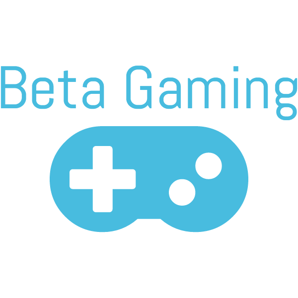

# Beta-Gaming

#### ¿Qué es BetaGaming?

    Beta-Gaming es una red social de código abierto para gamers.

#### ¿Por qué usar BetaGaming?

    Porque es una red social multiplataforma para jugadores de todo el mundo; Organiza partidas con tus amigos, participa en eventos y disfruta con jugadores de todo el mundo.

#### ¿Qué ventajas tiene BetaGaming?
    
    BetaGaming es la única red social que te permite organizar y crear a tu gusto partidas y eventos, buscar partidas y recibir sugerencias personalizadas.
